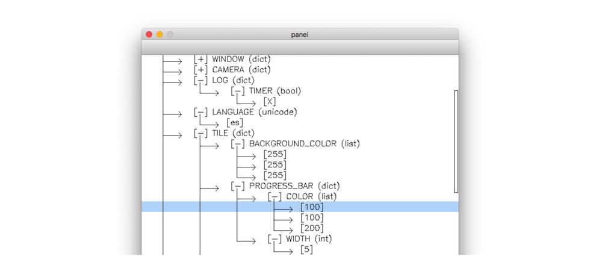
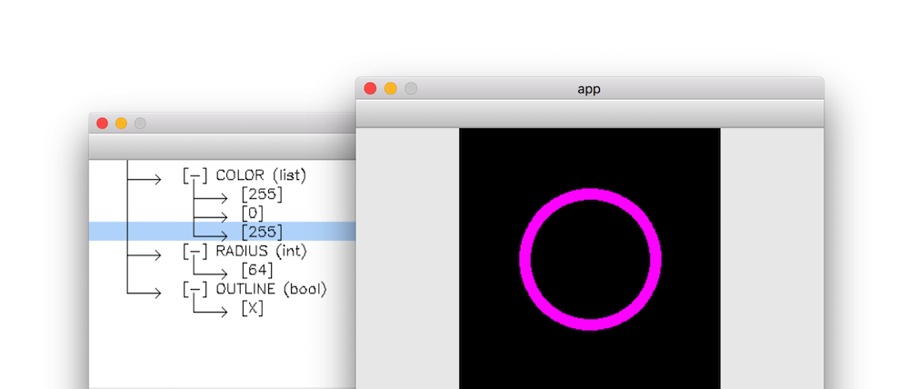
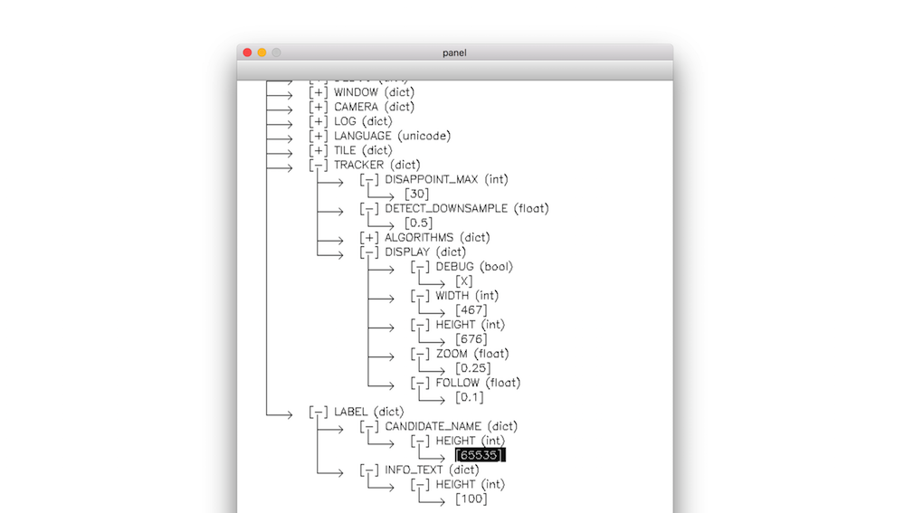
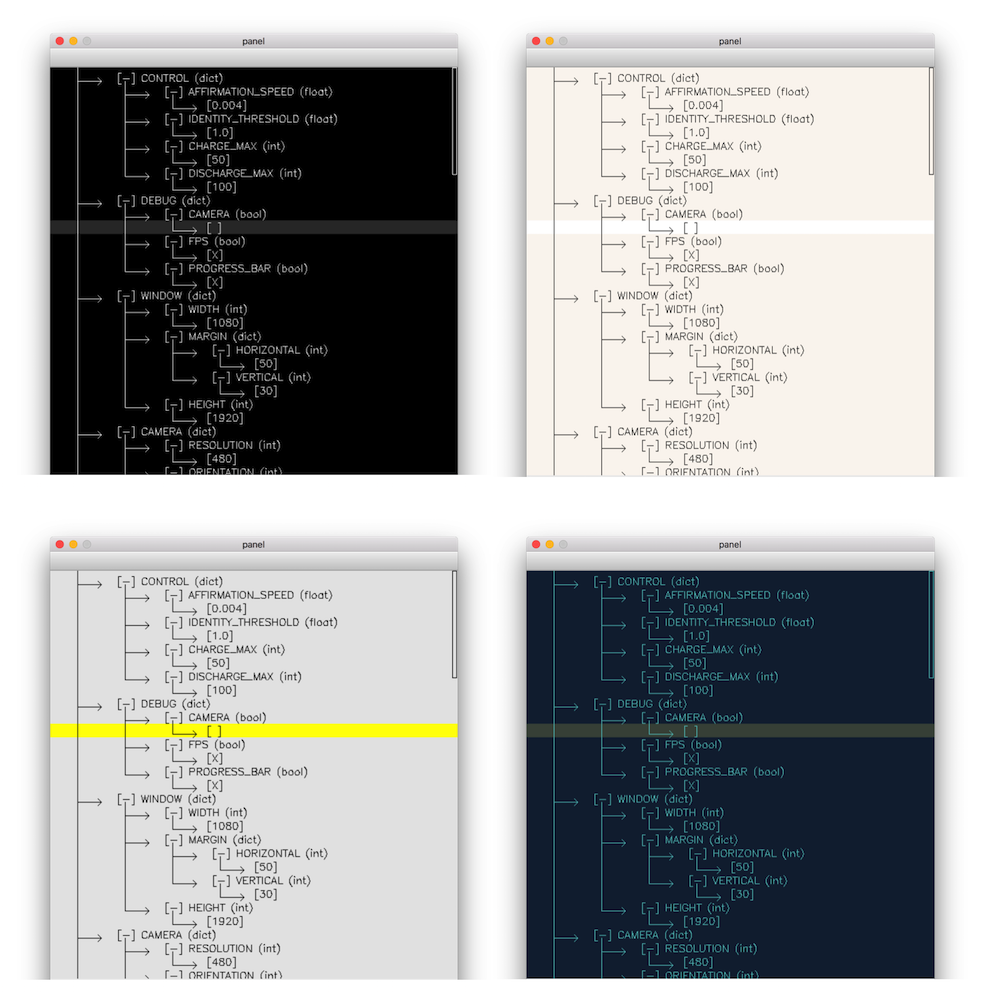

# cvDictUI
*opencv-python tool for generating interactive GUI from any python dictionary*



From any python dictionary, this simple tool generates a graphical user interface automatically to facilitate tweaking parameters in interactive python applications.

It presents a clean, hierarchical view of all your parameters, where groups of variables can be expanded or collapsed. It also gives you the power to edit integers, floats, strings, lists and dictionaries while your app is running, so you can watch them take effect in real time.

It is written in pure python, and uses opencv-python to render its graphics, so it's especially suitable for projects already using these technologies. 

## Features

### Tweak variables in realtime


### Expand, collapse and edit nested dictionaries


### Customizable themes


## Installation

### Dependencies

- [Python](https://www.python.org) (mainly tested on Python 2, but should be compatible with Python 3).
- [OpenCV-Python](https://opencv-python-tutroals.readthedocs.io/en/latest/) `pip install opencv-python`

### Usage

Simply copy-paste `cvDictUI.py` to your own project folder, and import it with `import cvDictUI.py`. Run the file directly for a couple of demos. 

## Controls

- `q` - exit
- `g` - toggle GUI display
- mouse drag to scroll up / down
- click on fields to edit, `enter`/`return` to confirm, `esc` or click elsewhere to cancel
- click on `[+]` `[-]` icon to expand / collapse

## Example

This example draws a circle on the screen, whose radius, color and outline are tweakable from a cvDictUI window.

```python
from cvDictUI import *

# initialize the dictionary containing values to be tweaked
dict_obj = {'color':[0,0,255],'radius':50,'outline':True}

# send the dictionary to cvDictUI
ui = DictUI('panel',dict_obj)
ui.setColors(*THEME_SIMPLE)

# mainloop
while True:
    
    # make a canvas
    im = np.zeros((256,256,3),np.uint8)
    
    # draw a circle with parameters from the dictionary
    cv2.circle(
    	im,(128,128),dict_obj["radius"],
    	color=tuple(dict_obj["color"]),
    	thickness=dict_obj["outline"]*11-1
    )
    
    # show the app window
    cv2.imshow("app",im)
    
    # send key events to cvDictUI
    key = cv2.waitKey(1) & 0xFF
    if not ui.update(key):
        break
        
ui.kill()
```
